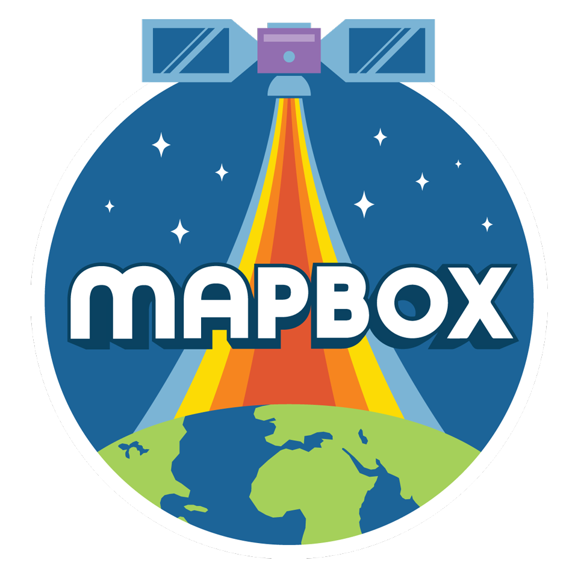

business cards are cool and all, but we wanted something a little less business and a little more party to hand out to folks. i love space, i love NASA, and i fucking _love_ the [NASA shuttle mission patches](http://history.nasa.gov/shuttle_patches.html). even the bad ones. so i drew us up our own mission patch, and we printed that badboy onto a sticker. mine's still clinging to my laptop. how's that for posterity?

fun fact: the bespoke typeface you see on the sticker was the beginning of [Central Union Mission]({{site.baseurl}}/central-union-mission/).