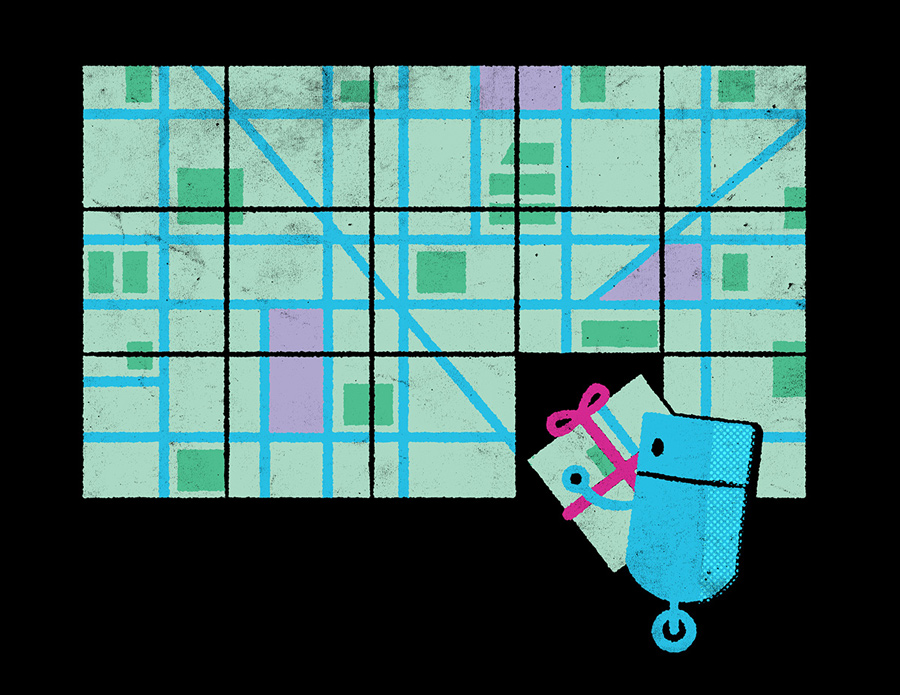

OpenStreetMap could be analogized to the Wikipedia of maps. it's a wonderful testament to the power of collaboration and the promise of open-source technology. it's also the underlying data architecture behind Mapbox Streets. we pulled together some stats to show everyone how every day it's becoming more and more of a force to be reckoned with, and i got to draw the visuals to go along with it.

see the [OSM Data Report](https://www.mapbox.com/osm-data-report/) in action.