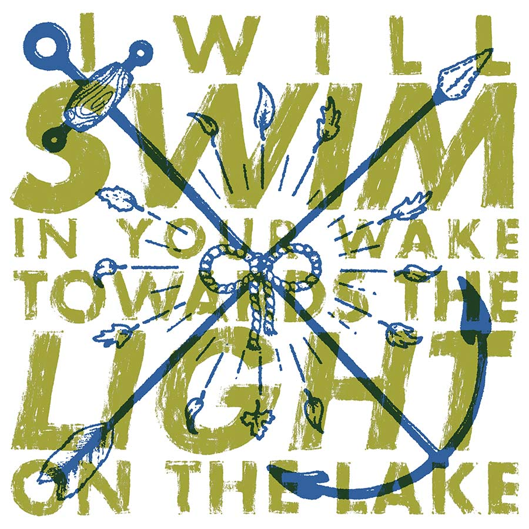
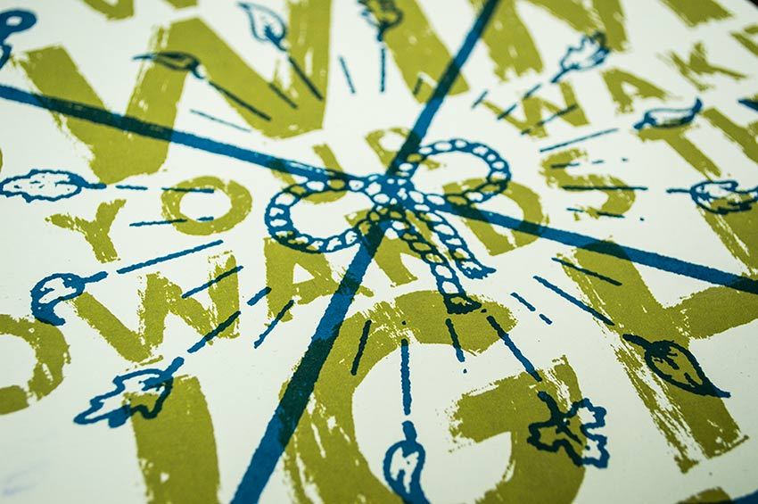

my good buds Signals Midwest are wonderful. they always put on a hell of a show, and they're some of the kindest, genuine, most thankful dudes i know. so when they put out a new LP and asked me to design & print something for the first 100 people who ordered it, i answered with a resounding "hell yes." 

two-color print on French speckletone white. run of 130. you know, just incase.