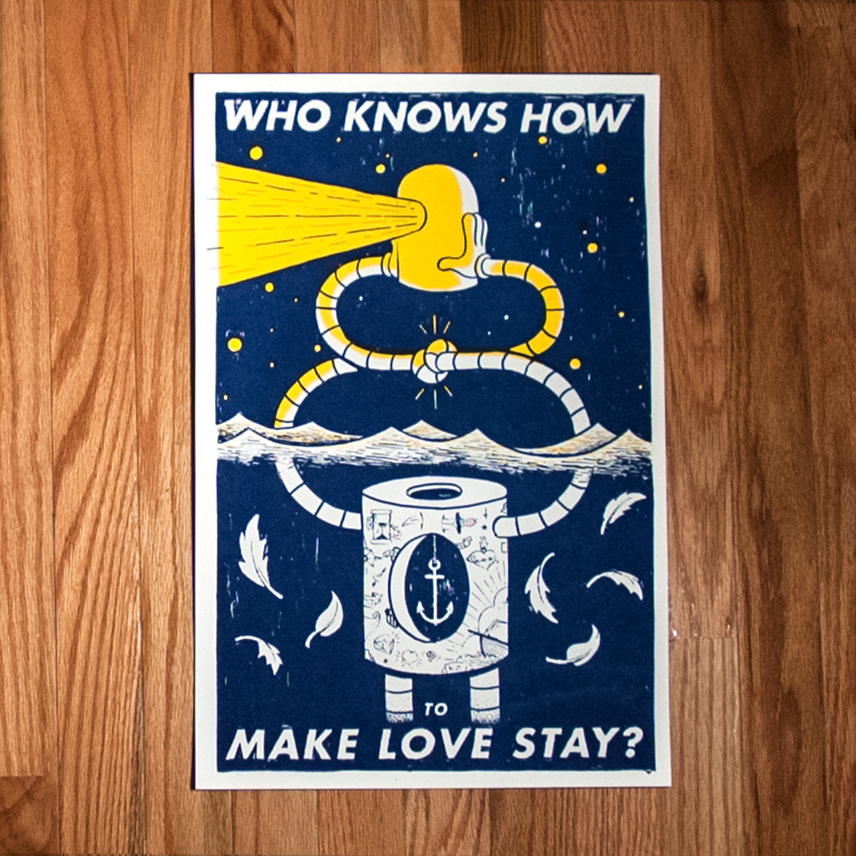

<iframe src="http://player.vimeo.com/video/62793060" width="100%" height="100%" style="position:absolute" frameborder="0" webkitAllowFullScreen="webkitAllowFullScreen" mozallowfullscreen="mozallowfullscreen" allowFullScreen="allowFullScreen"> </iframe>

personal screenprint. it was my first time drawing directly onto acetate, and i gotta say, i didn't hate it. after laboring over every line, there's a much more personal connection with the print, and it gives you nice imperfections that you just can't fake with a computer. that being said, i'm not abandonding the printed transparency anytime soon.
