i've long had an affinity for analog design practices, so dabbling in the non-digital side of photography was only a matter of time. after a less-than-sober ebay purchase, i had a Minolta XG-7 on my hands.

after developing my first rolls, it was apparent that it's seals were corroded, and there was considerable light leaking in (as you'll see). a reasonable punishment for buying a camera drunk at 2am and not inspecting it before shooting. i've since fixed it, but i don't think the accidental exposure ruins the photos effected. it just adds some character. 

so far, my experience with film has been wonderful, and it's seen my digital SLR gathering more & more dust these days.

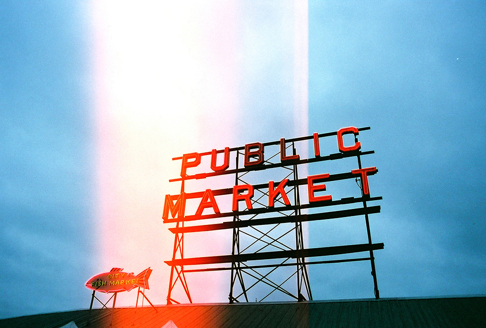
_Seattle, Washington_

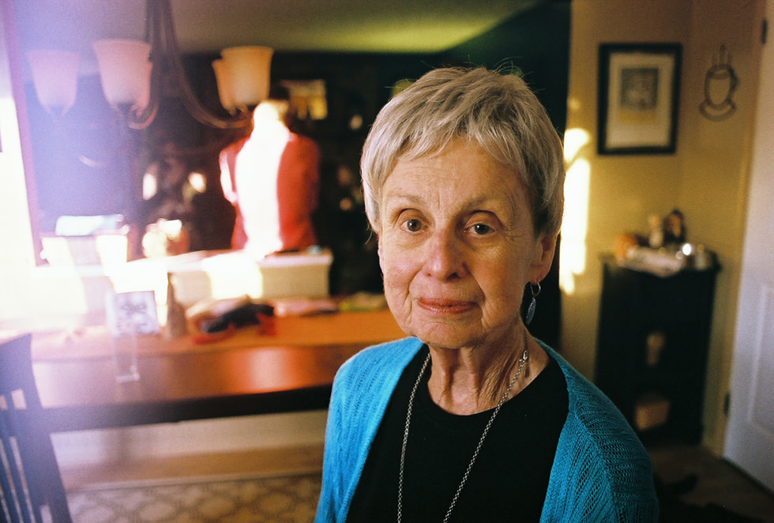
_this is the last photo i developed of my grandmother before she passed away. it's nice to have something tangible to hold on to._

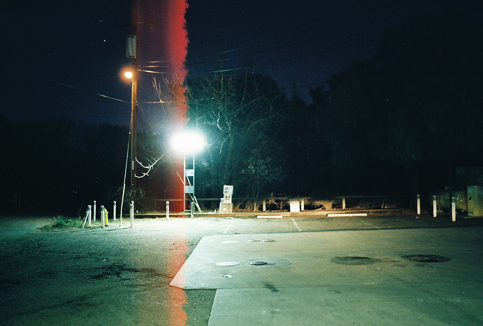
_an analog version of a photo taken somewhere between San Diego and San Francisco. see the digital version [here](http://ryantroyford.com/photo/2013-west-coast/)._

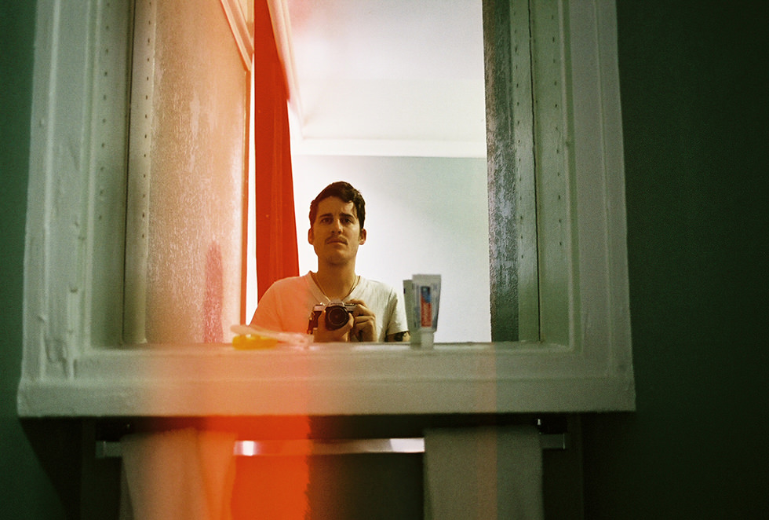
_self portrait in a San Francisco hostel mirror._

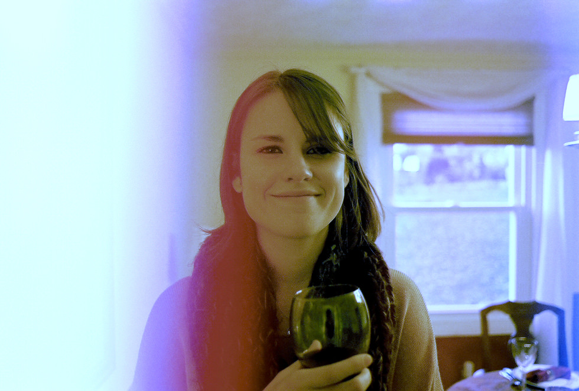
_my lovely and sometimes horrible sister Sarah._

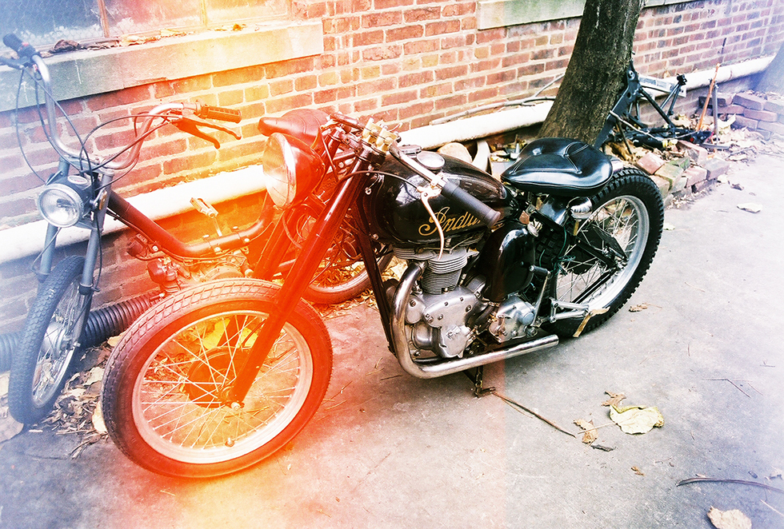
_1949 Indian_

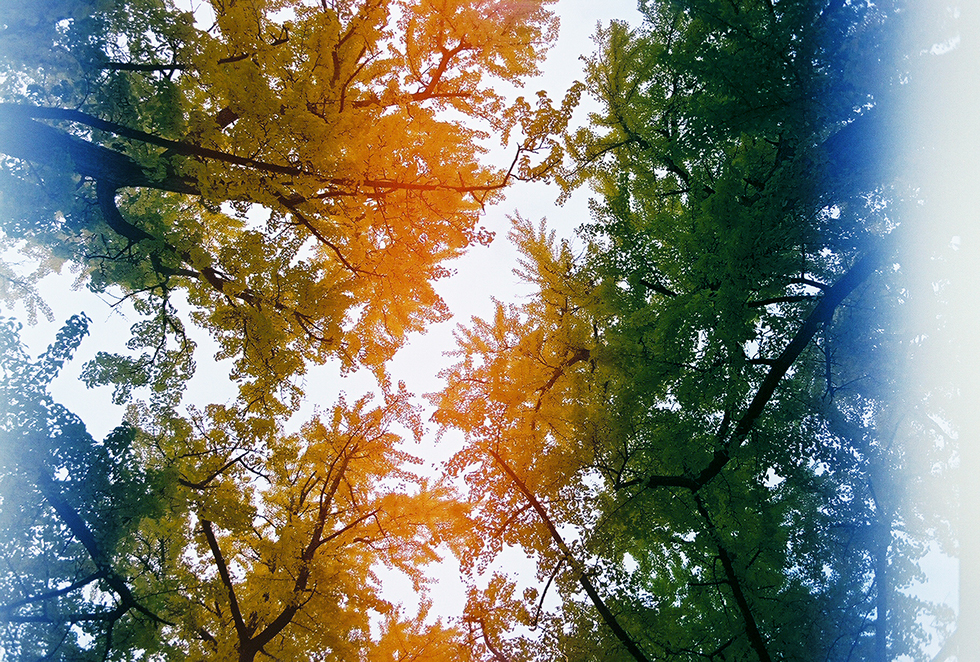

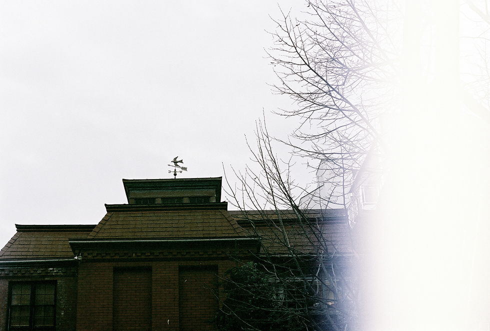

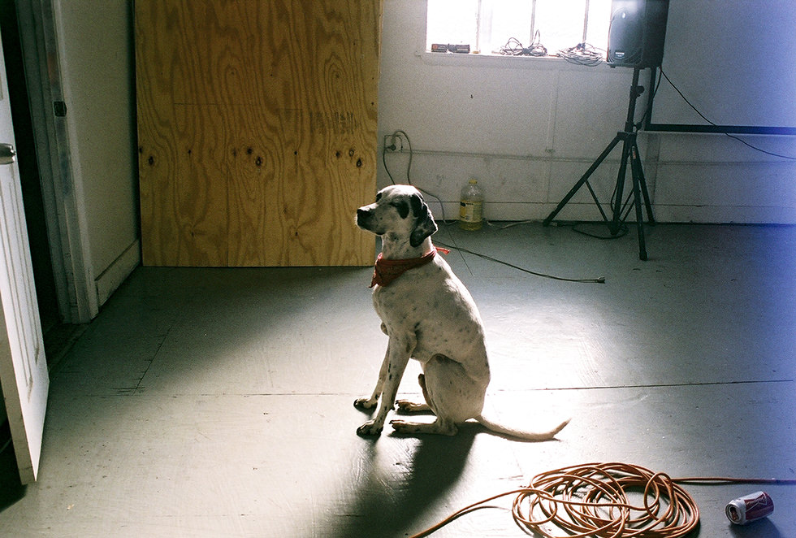
_Fletcher, the house dog at my former home. Hole in the Sky, Washington, DC._

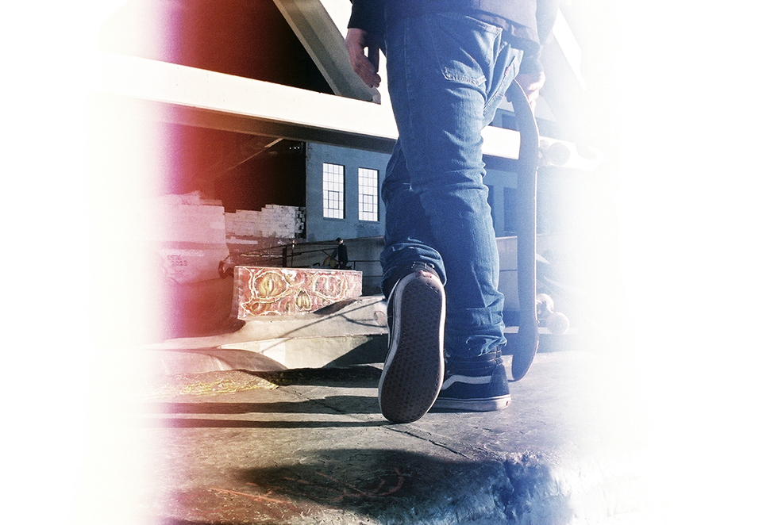
_Burnside skatepark, Portland, Oregon._

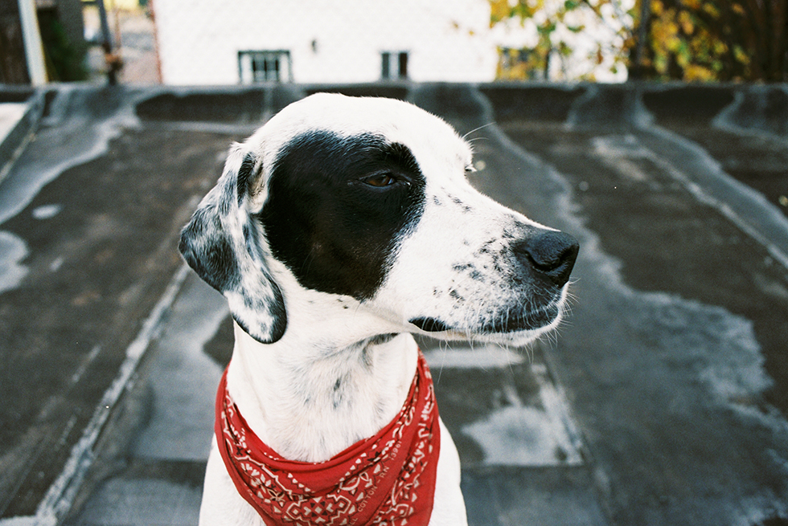

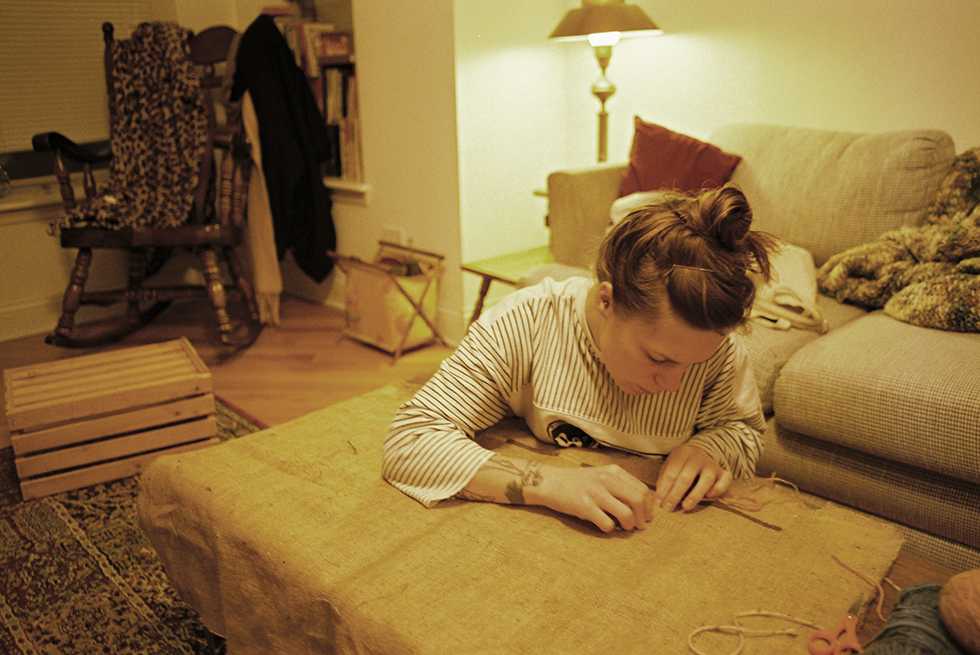

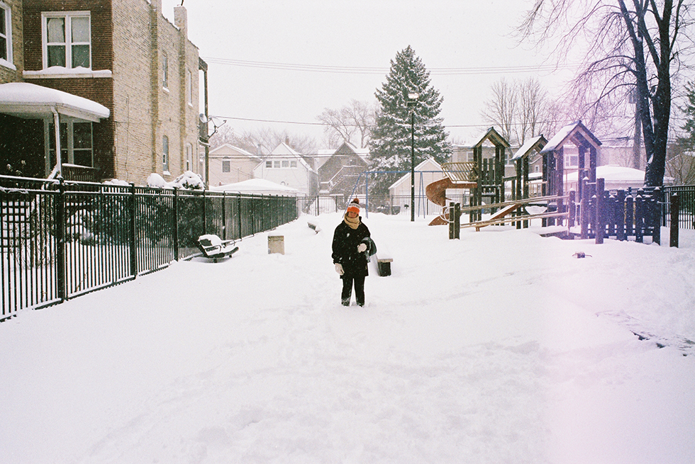
_Chicago, Illinois._

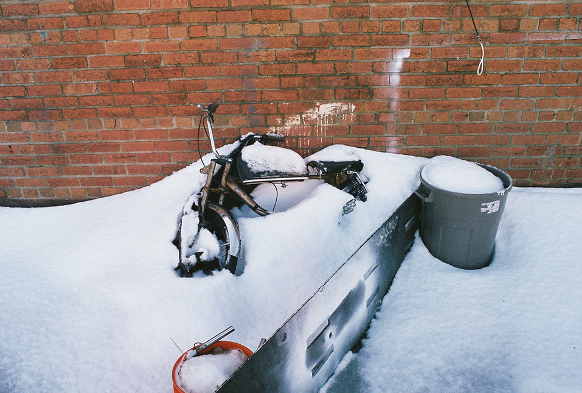

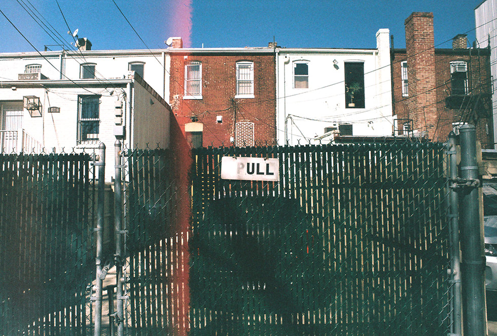
_from one of my final days in DC._

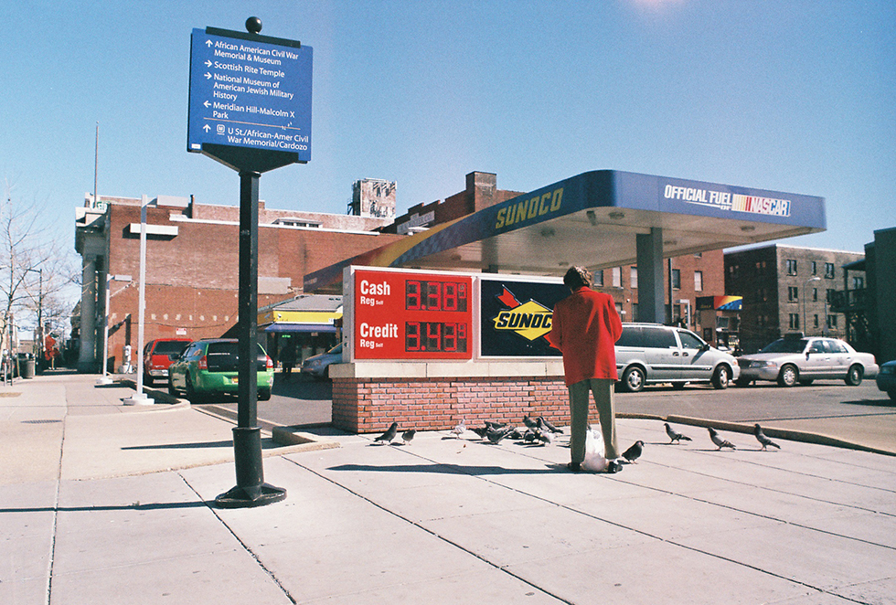

